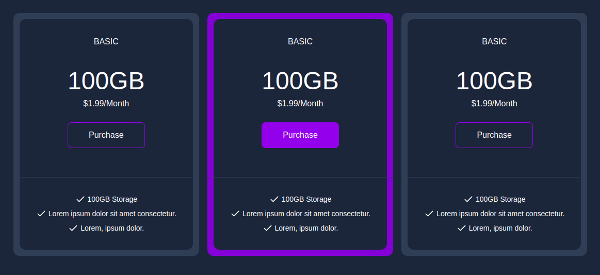
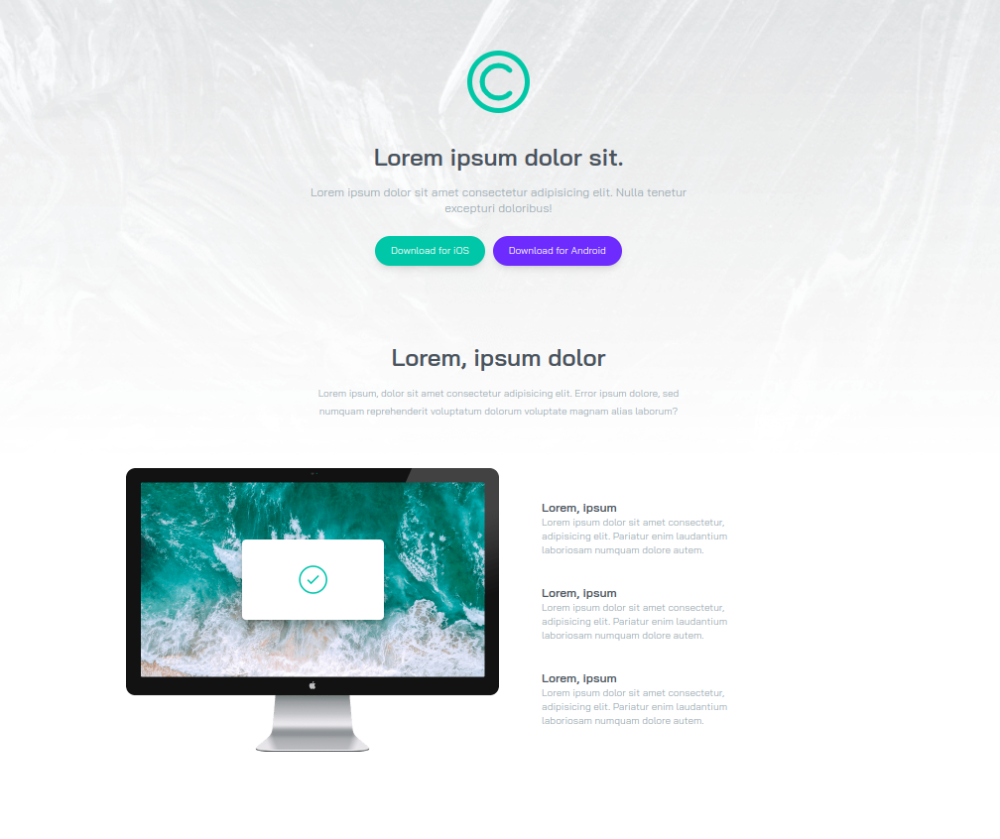

## Tailwind CSS POC 

#### Version Notes

```bash
npm 10.8.3
node 20.17.0
tailwind 3.4.13
```

### Mini Projects/Components
---

#### Email Subscribe Card


---

#### Pricing Grid


---

### Product Modal


---

### Image Gallery


---

### Login Modal


---

### Testimonial Grid (Design Reference - [Frontend Mentor Challenge](https://www.frontendmentor.io/challenges/testimonials-grid-section-Nnw6J7Un7))


---

### Clipboard Website (Design Reference - [Frontend Mentor Challenge](https://www.frontendmentor.io/challenges/clipboard-landing-page-5cc9bccd6c4c91111378ecb9))


---

### LoopStudios Website (Design Reference - [Frontend Mentor Challenge](https://www.frontendmentor.io/challenges/loopstudios-landing-page-N88J5Onjw))


---

